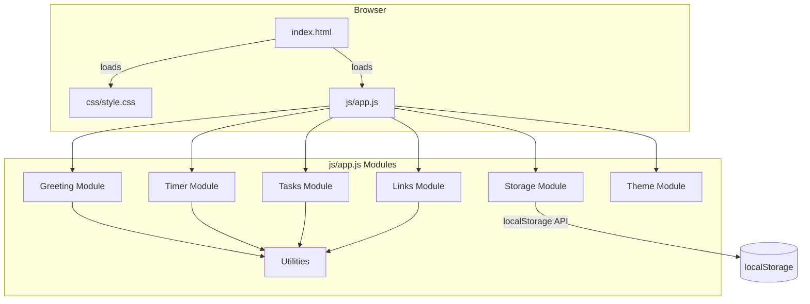
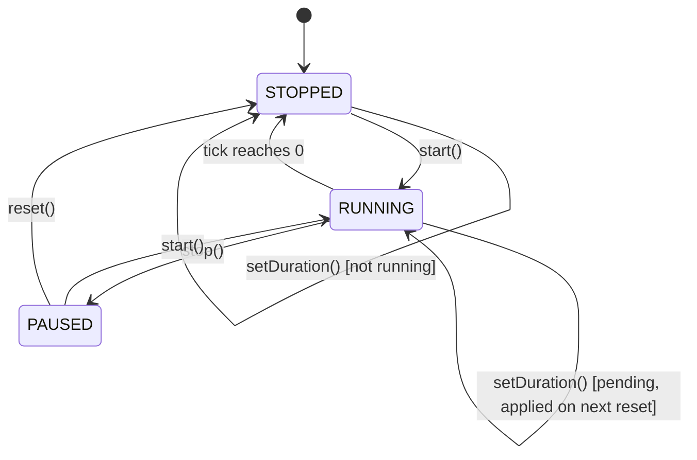

# Design Document — Todo Life Dashboard

## Overview

The Todo Life Dashboard is a single-page personal productivity homepage implemented in pure HTML, CSS, and Vanilla JavaScript with no build step or external dependencies. It runs entirely in the browser, persists all user data via the `localStorage` API, and must work across Chrome, Firefox, Edge, and Safari on viewport widths from 320 px to 2560 px.

The application is composed of four primary UI panels rendered inside a single `index.html` file, styled by `css/style.css`, and driven by `js/app.js`. The architecture is deliberately flat: no module bundler, no framework, no transpilation. All logic is written as plain ES2020 functions and a thin event-delegation layer that wires the DOM to state.

**Design goals:**
- Zero network round-trips after initial page load.
- All state transitions are synchronous and deterministic (except the `setInterval`-based timer tick).
- Storage reads/writes are isolated in a single `Storage` module so they can be replaced with stubs in tests.
- Pure helper functions (formatters, validators, sort) are separated from DOM manipulation so they can be unit-tested without a browser.

---

## Architecture

### High-Level Component Diagram



### Module Responsibilities

| Module | Responsibilities |
|---|---|
| **Storage** | Thin wrapper around `localStorage` — all reads/writes go through this module; swallows `SecurityError` when storage is blocked |
| **Greeting** | Time/date formatting, greeting text derivation, custom-name save/load, `setInterval` clock tick |
| **Timer** | Countdown state machine, `setInterval` tick, duration validation, audio notification |
| **Tasks** | Task CRUD, validation, duplicate detection, sorting, serialization, DOM rendering |
| **Links** | Link CRUD, validation, serialization, DOM rendering |
| **Theme** | Theme toggle, persistence, application of CSS class to `<html>` |
| **Utilities** | Shared pure helpers: `generateId`, `trimAndLower`, `clamp`, `padTwo` |

### Initialisation Sequence

```mermaid
sequenceDiagram
    participant DOM
    participant App
    participant Storage
    DOM->>App: DOMContentLoaded
    App->>Storage: load all persisted state
    App->>Theme: apply saved theme (or 'light')
    App->>Greeting: render time/date/greeting, start clock tick
    App->>Timer: render timer at saved duration
    App->>Tasks: restore tasks, apply saved sort, render list
    App->>Links: restore links, render panel
    App->>App: attach all event listeners via delegation
```

---

## Components and Interfaces

### 1. Storage Module

```javascript
// Wraps localStorage; returns null on any error instead of throwing.
Storage.get(key)          // → string | null
Storage.set(key, value)   // → boolean (true = success)
Storage.remove(key)       // → void
```

All other modules call `Storage.get` / `Storage.set` exclusively. If `Storage.set` returns `false`, the calling module shows an error indicator in the UI.

**Storage keys:**

| Key | Type | Description |
|---|---|---|
| `tld_name` | string | Custom greeting name |
| `tld_duration` | string (integer) | Pomodoro duration in minutes |
| `tld_tasks` | string (JSON) | Serialised task array |
| `tld_sort` | string | Sort preference identifier |
| `tld_links` | string (JSON) | Serialised link array |
| `tld_theme` | string | `"light"` or `"dark"` |

---

### 2. Greeting Module

**Public API:**
```javascript
Greeting.init()   // Reads saved name, renders panel, starts clock tick
Greeting.saveName(name)  // Validates, persists, and re-renders greeting
```

**Internal helpers (pure, testable):**
```javascript
formatTime(date)          // Date → "HH:MM"
formatDate(date)          // Date → "Weekday, DD MonthName YYYY"
getGreeting(hour)         // number (0–23) → greeting string
buildGreetingMessage(greeting, name)  // (string, string|null) → full greeting line
```

**Clock interval:** `setInterval(tick, 60_000)` fires every 60 seconds and calls `renderGreeting()`. The first render fires immediately on `init()` so there is no visible gap on load.

---

### 3. Timer Module

**Public API:**
```javascript
Timer.init()           // Loads saved duration, renders display, attaches buttons
Timer.start()          // Starts countdown
Timer.stop()           // Pauses countdown
Timer.reset()          // Resets to current duration
Timer.setDuration(mins) // Validates and sets new duration
```

**Timer state machine:**



**Button states:**

| State | Start | Stop | Reset |
|---|---|---|---|
| STOPPED | enabled | disabled | enabled |
| RUNNING | disabled | enabled | disabled |
| PAUSED | enabled | disabled | enabled |

**Internal helpers (pure, testable):**
```javascript
formatTimer(totalSeconds)       // number → "MM:SS"
validateDuration(value)         // any → boolean (true if integer 1–120)
```

**End-of-session notification:**
- Plays a short beep via the [Web Audio API](https://developer.mozilla.org/en-US/docs/Web/API/Web_Audio_API) (`AudioContext`, `OscillatorNode`) — no audio file required, works without network.
- Shows a `<div class="timer-notification">` overlay inside the timer card that is hidden by default and made visible on session end; it is dismissed on the next Start or Reset.

---

### 4. Tasks Module

**Public API:**
```javascript
Tasks.init()                   // Loads tasks + sort from storage, renders list
Tasks.addTask(title)           // Validates, deduplicates, appends, saves, re-renders
Tasks.toggleTask(id)           // Flips completion state, saves, re-renders
Tasks.startEdit(id)            // Switches task row to edit mode
Tasks.saveEdit(id, newTitle)   // Validates, updates, saves, re-renders
Tasks.cancelEdit(id)           // Reverts edit row to read view
Tasks.deleteTask(id)           // Removes by id, saves, re-renders
Tasks.setSort(option)          // Persists sort option, re-renders
```

**Internal helpers (pure, testable):**
```javascript
validateTaskTitle(title)        // string → { valid: boolean, error: string }
isDuplicate(tasks, title)       // (Task[], string) → boolean
sortTasks(tasks, option)        // (Task[], SortOption) → Task[]  (returns new array, mutates nothing)
serializeTasks(tasks)           // Task[] → string (JSON)
deserializeTasks(json)          // string → Task[] (returns [] on malformed input)
createTask(title)               // string → Task object
editTask(task, newTitle)        // (Task, string) → Task (new object)
toggleTask(task)                // Task → Task (new object, flipped completed)
deleteTask(tasks, id)           // (Task[], string) → Task[] (new array)
```

**Task rendering:** Each task is rendered as a `<li>` element via `renderTaskItem(task)` which returns an HTML string. The list is fully re-rendered on every state change (simple and avoids reconciliation complexity for up to 100 items).

**Inline error display:** A `<span class="error-msg">` next to the input is shown/hidden by toggling a CSS class. Errors auto-clear on next `input` event on the relevant field.

---

### 5. Links Module

**Public API:**
```javascript
Links.init()                   // Loads links from storage, renders panel
Links.addLink(name, url)       // Validates, appends, saves, re-renders
Links.deleteLink(id)           // Removes by id, saves, re-renders
```

**Internal helpers (pure, testable):**
```javascript
validateLink(name, url, currentCount)  // (string, string, number) → { valid: boolean, errors: object }
createLink(name, url)                  // (string, string) → Link object
deleteLink(links, id)                  // (Link[], string) → Link[] (new array)
serializeLinks(links)                  // Link[] → string (JSON)
deserializeLinks(json)                 // string → Link[] (returns [] on malformed input)
```

**Link rendering:** Each link is rendered as a `<button>` (or `<a>` with `role="button"`) that `window.open`s the URL with `target="_blank"` and `rel="noopener noreferrer"`.

---

### 6. Theme Module

**Public API:**
```javascript
Theme.init()       // Loads saved theme, applies to <html> element
Theme.toggle()     // Flips current theme, persists, re-applies
```

**Internal helpers (pure, testable):**
```javascript
resolveTheme(stored)   // string|null → 'light' | 'dark'
```

**Application mechanism:** Theme is applied by setting `document.documentElement.dataset.theme = 'light' | 'dark'` (or a CSS class `theme-dark` on `<html>`). All colour tokens in `style.css` are defined as CSS custom properties on `:root` and overridden by `[data-theme="dark"]`.

---

## Data Models

### Task

```javascript
{
  id:        string,   // UUID-like: crypto.randomUUID() or Date.now() + Math.random() fallback
  title:     string,   // 1–200 chars, at least 1 non-whitespace char
  completed: boolean,  // default: false
  createdAt: number    // Unix timestamp (Date.now()) at creation time
}
```

**Validation constraints:**
- `title.trim().length >= 1`
- `title.length <= 200`
- `title.trim().toLowerCase()` must not match any existing task's `title.trim().toLowerCase()`

**Capacity:** Up to 100 tasks are persisted. A 101st task submission is rejected with an error message.

**localStorage schema (key: `tld_tasks`):**
```json
[
  { "id": "abc123", "title": "Buy milk", "completed": false, "createdAt": 1725100000000 },
  { "id": "def456", "title": "Review PR", "completed": true,  "createdAt": 1725099000000 }
]
```

---

### Link

```javascript
{
  id:   string,  // UUID-like
  name: string,  // 1–50 chars
  url:  string   // starts with http:// or https://, max 2048 chars
}
```

**Validation constraints:**
- `name.trim().length >= 1 && name.trim().length <= 50`
- `/^https?:\/\//i.test(url)` (case-insensitive)
- `url.length <= 2048`
- Total stored links < 20

**localStorage schema (key: `tld_links`):**
```json
[
  { "id": "lnk1", "name": "GitHub", "url": "https://github.com" }
]
```

---

### Timer Settings

Stored as a plain integer string in `tld_duration`. Range: 1–120.

```
"25"
```

---

### Sort Preference

Stored as a plain string in `tld_sort`. Valid values: `"default"`, `"az"`, `"za"`.

```
"az"
```

---

### Theme Preference

Stored as a plain string in `tld_theme`. Valid values: `"light"`, `"dark"`.

```
"dark"
```

---

### Custom Name

Stored as a plain string in `tld_name`. Max 50 chars after trim.

```
"Rizki"
```

---

## UI Layout

### Grid Structure

The layout uses CSS Grid on a `<main class="dashboard">` container.

```
┌─────────────────────────────────────────────────────────────┐
│  GREETING PANEL           (full width, row 1)               │
│  Time: 09:41   Date: Monday, 12 September 2026              │
│  Good morning, Rizki                                        │
├────────────────────────┬────────────────────────────────────┤
│  FOCUS TIMER           │  TASK LIST                        │
│  (bottom-left)         │  (top-right)                      │
│  25:00                 │  [ Input .............. ] [Add]   │
│  [Start] [Stop] [Reset]│  ☐ Buy milk         [✎] [✕]     │
│  Duration: [25] mins   │  ☑ Review PR        [✎] [✕]     │
├────────────────────────┼────────────────────────────────────┤
│  QUICK LINKS           │  (TASK LIST continues)            │
│  (bottom-left)         │                                   │
│  Name: [     ] URL: [  ]│                                  │
│  [Add Link]            │                                   │
│  [GitHub ×] [Docs ×]   │                                   │
└────────────────────────┴────────────────────────────────────┘
```

**CSS Grid definition (desktop ≥768 px):**
```css
.dashboard {
  display: grid;
  grid-template-columns: 1fr 1fr;
  grid-template-rows: auto auto auto;
  gap: 1.5rem;
}
.panel-greeting { grid-column: 1 / -1; }
.panel-timer    { grid-column: 1; grid-row: 2; }
.panel-tasks    { grid-column: 2; grid-row: 2 / 4; }
.panel-links    { grid-column: 1; grid-row: 3; }
```

**Mobile (< 768 px):** Single-column stack. All panels span full width in source order: Greeting → Timer → Tasks → Links.

**Very wide (> 1400 px):** Max-width container centred to `1400px` to prevent excessive stretching.

### Visual Design

- Background: purple-to-blue gradient (`linear-gradient(135deg, #667eea 0%, #764ba2 100%)`)
- Cards: white (`#ffffff`) in light mode, dark charcoal (`#1e1e2e`) in dark mode; `border-radius: 16px`; `box-shadow` for depth
- Primary accent: blue (`#4a90e2`) used for the time display and focus actions
- Typography: system-ui font stack for zero network requests
- Theme tokens defined as CSS custom properties on `:root` / `[data-theme="dark"]`

---

## State Management Approach

There is no global state object or reactive store. Each module owns its own in-memory state as a module-scoped variable:

```javascript
// In Tasks module (inside IIFE or top-level in app.js)
let _tasks = [];
let _sort = 'default';

// In Timer module
let _state = 'STOPPED';     // 'RUNNING' | 'PAUSED' | 'STOPPED'
let _remaining = 25 * 60;   // seconds
let _duration = 25;         // minutes
let _pendingDuration = null; // set when duration changes while running
let _intervalId = null;
```

**State update flow:**
1. User event fires (click, input, submit).
2. Event handler calls the relevant Module method.
3. Module method mutates its private state, calls `Storage.set` if needed, then calls the module's render function.
4. Render function writes to the DOM.

This unidirectional flow keeps state changes traceable without a framework.

---

## Event Handling Patterns

### Event Delegation

Rather than attaching individual listeners to each task row or link button (which would need to be re-attached after every re-render), all list-level events are handled via a single delegated listener on the list container:

```javascript
document.getElementById('task-list').addEventListener('click', (e) => {
  const id = e.target.closest('[data-id]')?.dataset.id;
  if (!id) return;
  if (e.target.matches('.task-toggle'))  Tasks.toggleTask(id);
  if (e.target.matches('.task-edit'))    Tasks.startEdit(id);
  if (e.target.matches('.task-delete'))  Tasks.deleteTask(id);
  if (e.target.matches('.task-save'))    Tasks.saveEdit(id, /* get value from input */);
  if (e.target.matches('.task-cancel'))  Tasks.cancelEdit(id);
});
```

The same pattern is used for the links panel.

### Form Submission

The task add form and link add form listen to `submit` events to support both Enter-key and button-click submission without duplication.

### Timer Buttons

Timer buttons use direct `addEventListener` calls on named elements — they are static and never re-rendered.

### Theme Toggle

Single `change` or `click` listener on the toggle control; calls `Theme.toggle()`.

### Name Input

`blur` and Enter-key `keydown` on the name input trigger `Greeting.saveName()`.

### Sort Control

`change` listener on the sort `<select>` triggers `Tasks.setSort(select.value)`.

---

## Correctness Properties

*A property is a characteristic or behavior that should hold true across all valid executions of a system — essentially, a formal statement about what the system should do. Properties serve as the bridge between human-readable specifications and machine-verifiable correctness guarantees.*

---

### Property 1: Time format is always HH:MM

*For any* `Date` object, `formatTime(date)` SHALL produce a string that matches the pattern `^\d{2}:\d{2}$` where the hour component is in [0, 23] and the minute component is in [0, 59].

**Validates: Requirements 1.1**

---

### Property 2: Date format matches "Weekday, DD MonthName YYYY"

*For any* `Date` object, `formatDate(date)` SHALL produce a string that matches the pattern `^(Sunday|Monday|Tuesday|Wednesday|Thursday|Friday|Saturday), \d{2} \w+ \d{4}$` with correct values for each component derived from the given date.

**Validates: Requirements 1.2**

---

### Property 3: Greeting covers all hours exhaustively and without overlap

*For any* integer `hour` in [0, 23], `getGreeting(hour)` SHALL return exactly one of "Good morning", "Good afternoon", "Good evening", or "Good night", and the mapping SHALL be consistent with the time ranges defined in Requirements 1.3–1.6 for every possible hour value.

**Validates: Requirements 1.3, 1.4, 1.5, 1.6**

---

### Property 4: Greeting message includes name when name is non-empty

*For any* non-empty trimmed name string `n` and any greeting string `g`, `buildGreetingMessage(g, n)` SHALL return a string equal to `g + ", " + n`.

**Validates: Requirements 2.2**

---

### Property 5: Custom name localStorage round-trip

*For any* string `n` of 1–50 characters containing at least one non-whitespace character, calling `saveName(n)` followed by `loadName()` SHALL return a string equal to `n.trim()`.

**Validates: Requirements 2.3**

---

### Property 6: Timer format is always MM:SS

*For any* non-negative integer `seconds` in [0, 7200], `formatTimer(seconds)` SHALL produce a string that matches `^\d{2}:\d{2}$` where the minutes component is `Math.floor(seconds / 60)` zero-padded to 2 digits and the seconds component is `seconds % 60` zero-padded to 2 digits.

**Validates: Requirements 3.1**

---

### Property 7: Duration validation accepts exactly the valid range

*For any* value `d`, `validateDuration(d)` SHALL return `true` if and only if `d` is an integer satisfying `1 ≤ d ≤ 120`.

**Validates: Requirements 3.9, 4.1, 4.4**

---

### Property 8: Pomodoro duration localStorage round-trip

*For any* integer `d` in [1, 120], calling `saveDuration(d)` followed by `loadDuration()` SHALL return an integer equal to `d`.

**Validates: Requirements 4.3**

---

### Property 9: Adding a valid task increases list length by exactly one

*For any* task array `tasks` with fewer than 100 items and any valid task title `t` (non-whitespace, 1–200 chars, no duplicate in `tasks`), `addTask(tasks, t)` SHALL return an array whose length equals `tasks.length + 1` and whose last element has `title === t.trim()` and `completed === false`.

**Validates: Requirements 5.2**

---

### Property 10: Whitespace-only titles are always invalid

*For any* string composed entirely of whitespace characters (including the empty string), `validateTaskTitle(s).valid` SHALL be `false`.

**Validates: Requirements 5.3, 5.9**

---

### Property 11: Task toggle is its own inverse

*For any* `Task` object `t`, `toggleTask(toggleTask(t)).completed` SHALL equal `t.completed`. (Two toggles restore the original state.)

**Validates: Requirements 5.6**

---

### Property 12: Editing a task updates title and preserves all other fields

*For any* `Task` object `task` and valid title string `newTitle`, `editTask(task, newTitle)` SHALL return an object where `.title === newTitle.trim()`, `.completed === task.completed`, `.id === task.id`, and `.createdAt === task.createdAt`.

**Validates: Requirements 5.8**

---

### Property 13: Deleting a task removes exactly that task

*For any* task array `tasks` and any `id` present in `tasks`, `deleteTask(tasks, id)` SHALL return an array that does not contain any element with `.id === id` and has length equal to `tasks.length - 1`.

**Validates: Requirements 5.11**

---

### Property 14: Task collection localStorage round-trip

*For any* array `tasks` of valid `Task` objects (up to 100), `deserializeTasks(serializeTasks(tasks))` SHALL return an array that is deeply equal to `tasks` (same length, same titles, completion states, IDs, and timestamps in the same order).

**Validates: Requirements 6.1, 6.2**

---

### Property 15: Duplicate detection is case-insensitive and trim-invariant

*For any* task array `tasks` containing a task with title `T`, and any string `s` such that `s.trim().toLowerCase() === T.trim().toLowerCase()`, `isDuplicate(tasks, s)` SHALL return `true`.

**Validates: Requirements 7.1**

---

### Property 16: Sort produces correct orderings

*For any* task array `tasks`:
- `sortTasks(tasks, 'default')` SHALL return tasks in non-increasing order of `createdAt`.
- `sortTasks(tasks, 'az')` SHALL return tasks in non-decreasing lexicographic order of `title.trim().toLowerCase()`.
- `sortTasks(tasks, 'za')` SHALL return an array that is the reverse of `sortTasks(tasks, 'az')`.

In all cases, the original `tasks` array SHALL be unmodified.

**Validates: Requirements 8.2, 8.3, 8.4**

---

### Property 17: Sort preference localStorage round-trip

*For any* sort option string `o` in `{'default', 'az', 'za'}`, calling `saveSort(o)` followed by `loadSort()` SHALL return a string equal to `o`.

**Validates: Requirements 8.5, 8.6**

---

### Property 18: Adding a valid link increases link count by exactly one

*For any* links array `links` with fewer than 20 items and any valid link `{name, url}` (name 1–50 chars, URL starts with `http://` or `https://` case-insensitively, URL ≤ 2048 chars), `addLink(links, name, url)` SHALL return an array of length `links.length + 1` containing an element with the given name and url.

**Validates: Requirements 9.2**

---

### Property 19: Link validation rejects all invalid inputs

*For any* link submission where: name is empty, or name exceeds 50 characters, or URL does not begin with `http://` or `https://` (case-insensitive), or URL exceeds 2048 characters, `validateLink(name, url, count).valid` SHALL be `false`.

**Validates: Requirements 9.3, 9.9**

---

### Property 20: Deleting a link removes exactly that link

*For any* links array `links` and any `id` present in `links`, `deleteLink(links, id)` SHALL return an array that does not contain any element with `.id === id` and has length equal to `links.length - 1`.

**Validates: Requirements 9.5**

---

### Property 21: Link collection localStorage round-trip

*For any* array `links` of valid `Link` objects (up to 20), `deserializeLinks(serializeLinks(links))` SHALL return an array deeply equal to `links`.

**Validates: Requirements 9.6, 9.7**

---

### Property 22: Theme persistence round-trip

*For any* theme string `t` in `{'light', 'dark'}`, calling `saveTheme(t)` followed by `loadTheme()` SHALL return a string equal to `t`.

**Validates: Requirements 10.3**

---

## Error Handling

### Storage Errors

The `Storage` module wraps all `localStorage` calls in `try/catch`. If `localStorage` is unavailable (e.g., private browsing with storage blocked, `SecurityError`):
- `Storage.get()` returns `null`.
- `Storage.set()` returns `false`.

Each module checks the return value of `Storage.set()` and, if `false`, displays a dismissible banner: _"Your changes could not be saved — storage is unavailable."_

On load, if `Storage.get()` returns `null` for a collection key, the module initialises with an empty default state.

### Malformed JSON

`deserializeTasks` and `deserializeLinks` wrap `JSON.parse` in `try/catch`. Any parse error returns an empty array `[]` and the UI initialises from scratch. This prevents a single corrupted storage entry from breaking the whole dashboard.

### Validation Errors

All validation errors are displayed as inline `<span class="error-msg">` elements adjacent to the relevant input field. They are:
- Shown immediately on failed submission.
- Cleared on the next `input` event on the associated field, or when a successful submission occurs.

Errors are identified by `id` or `aria-describedby` to maintain screen-reader accessibility.

### Timer Audio

The Web Audio API `AudioContext` is created lazily on the first user interaction (to comply with browser autoplay policies). If `AudioContext` is not supported (extremely rare), the visual notification is still shown and the audio alert is silently skipped.

---

## Testing Strategy

### Unit Tests (Pure Functions)

A test file (`js/app.test.js`) uses a lightweight test runner compatible with plain Node.js (e.g., [uvu](https://github.com/lukeed/uvu) or a hand-rolled `assert`-based suite). No DOM required for pure function tests.

Functions covered by unit tests:
- `formatTime`, `formatDate`, `getGreeting`, `buildGreetingMessage`
- `formatTimer`, `validateDuration`
- `validateTaskTitle`, `isDuplicate`, `sortTasks`, `serializeTasks`, `deserializeTasks`, `createTask`, `editTask`, `toggleTask`, `deleteTask`
- `validateLink`, `createLink`, `deleteLink`, `serializeLinks`, `deserializeLinks`
- `resolveTheme`
- `Storage.get`, `Storage.set` (with a mock `localStorage`)

Unit tests focus on specific examples, edge cases, and error conditions:
- Boundary values (0, 1, 200, 201, 50, 51 characters, etc.)
- Empty strings, whitespace-only strings, null inputs
- Malformed JSON for deserializers
- All 24 hours for `getGreeting`

### Property-Based Tests

Property-based tests are implemented using [fast-check](https://github.com/dubzzz/fast-check) for Node.js. Each test runs a minimum of 100 iterations with randomly generated inputs.

Each test is tagged with:
```javascript
// Feature: todo-life-dashboard, Property N: <property_text>
```

Properties covered (see Correctness Properties section for full statements):
- Property 1: Time format is always HH:MM
- Property 2: Date format matches "Weekday, DD MonthName YYYY"
- Property 3: Greeting covers all hours exhaustively
- Property 4: Greeting message includes name when non-empty
- Property 5: Custom name localStorage round-trip
- Property 6: Timer format is always MM:SS
- Property 7: Duration validation accepts exactly the valid range
- Property 8: Pomodoro duration localStorage round-trip
- Property 9: Adding a valid task increases list length by one
- Property 10: Whitespace-only titles are always invalid
- Property 11: Task toggle is its own inverse
- Property 12: Editing preserves all task fields except title
- Property 13: Deleting removes exactly that task
- Property 14: Task collection localStorage round-trip
- Property 15: Duplicate detection is case-insensitive and trim-invariant
- Property 16: Sort produces correct orderings
- Property 17: Sort preference localStorage round-trip
- Property 18: Adding a valid link increases count by one
- Property 19: Link validation rejects all invalid inputs
- Property 20: Deleting a link removes exactly that link
- Property 21: Link collection localStorage round-trip
- Property 22: Theme persistence round-trip

### Integration / Manual Tests

The following scenarios require a real browser and are verified manually:
- Timer audible alert fires at session end (Web Audio API)
- Theme applies visually within 100 ms of toggle
- `localStorage` unavailable banner (test in Firefox with cookies/storage blocked)
- Page load performance ≤ 2 s (measured via DevTools Network tab)
- Responsive layout at 320 px, 768 px, 1024 px, 1440 px, 2560 px viewports
- Cross-browser smoke test in Chrome, Firefox, Edge, Safari

### Accessibility Checks

- All interactive controls have accessible labels (`aria-label` or visible `<label>`)
- Error messages are linked to inputs via `aria-describedby`
- Colour contrast meets WCAG AA (4.5:1 for normal text) in both themes
- Focus ring is visible in both themes
- Full validation requires manual testing with a screen reader (e.g., NVDA + Firefox, VoiceOver + Safari)
