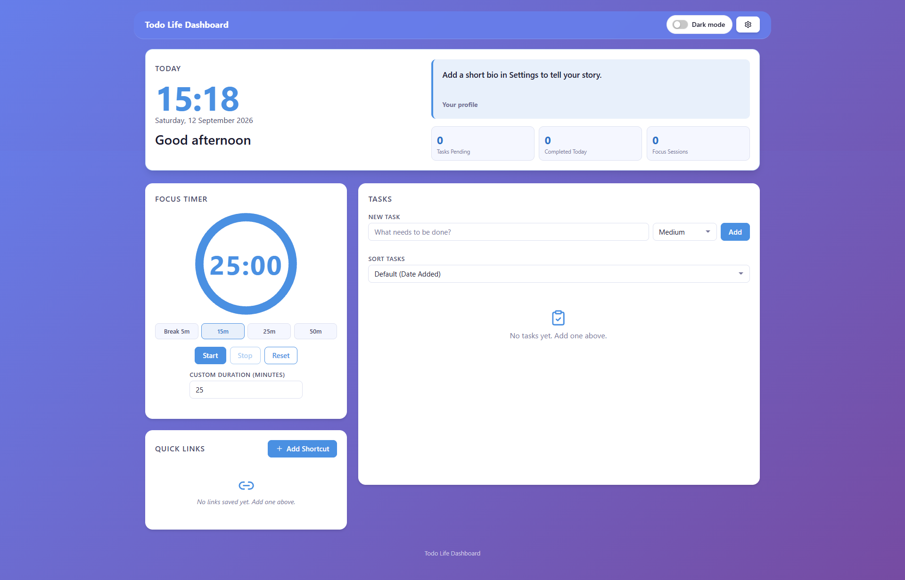
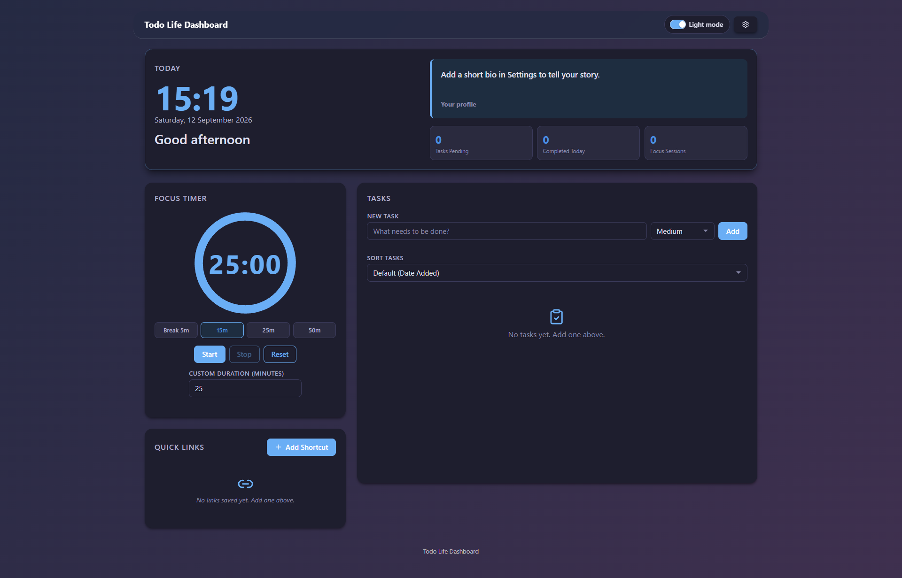

# Todo Life Dashboard

Todo Life Dashboard is a single-page web application designed to support daily productivity. It includes a personalized profile panel, a Pomodoro focus timer, a to-do list, quick links, and light and dark themes.

The application is built with HTML, CSS, and Vanilla JavaScript. It does not require a framework, backend, or build tool. User data is stored in the browser using `localStorage`. Lucide icons are loaded from the Lucide CDN for interface controls.

## Documentation

### Light Mode



### Dark Mode



## Features

### Profile and Greeting Panel

- Displays the local time in 24-hour `HH:MM` format.
- Updates the time every 60 seconds.
- Displays the date in `Weekday, DD MonthName YYYY` format.
- Changes the greeting based on the current time:
  - `05:00–11:59`: Good morning
  - `12:00–17:59`: Good afternoon
  - `18:00–20:59`: Good evening
  - `21:00–04:59`: Good night
- Allows the user to enter and save a personalized display name from the Settings modal.
- Supports a user profile bio that is displayed dynamically on the dashboard.
- Displays pending tasks, completed tasks, and focus-session summary statistics.
- Uses a two-column layout on desktop and a full-width responsive card on mobile.

### Focus Timer

- Displays the countdown in `MM:SS` format.
- Uses a circular progress ring that decreases as the session runs.
- Uses a default duration of 25 minutes.
- Allows durations from 1 to 120 minutes.
- Provides quick presets: Break 5m, 15m, 25m, and 50m.
- Provides Start, Stop, and Reset controls.
- Stop pauses the timer while preserving the remaining time.
- Reset stops the timer and restores the active duration.
- Shows a visual notification and plays an audio alert when the countdown reaches `00:00`.
- Applies duration changes made while the timer is running after the current session is reset.

### Task List

- Add, edit, complete, and delete tasks.
- Validates task titles:
  - Titles cannot be empty or contain only whitespace.
  - Titles cannot exceed 200 characters.
- Supports up to 100 tasks.
- Prevents duplicate titles using case-insensitive comparison.
- Provides the following sorting options:
  - Default (Date Added)
  - A → Z
  - Z → A
- Supports priority badges: High, Medium, and Low.
- Supports drag-and-drop task reordering.
- Shows visual feedback when a task is completed.
- Stores tasks and sorting preferences in `localStorage`.

### Quick Links

- Add links with a name and URL.
- URLs must begin with `http://` or `https://`.
- Link names cannot exceed 50 characters.
- URLs cannot exceed 2048 characters.
- Supports up to 20 links.
- Opens links in a new browser tab.
- Allows links to be deleted.
- Adds links through a modal instead of a permanent input form.
- Displays shortcuts in a favicon grid.
- Supports drag-and-drop shortcut reordering.
- Stores links in `localStorage`.

### Themes and Accessibility

- Supports light and dark themes.
- Uses a sliding Dark Mode switch in the sticky header.
- Dynamically changes the main background gradient for light and dark themes.
- Saves and restores the selected theme when the page is reloaded.
- Defaults to the light theme.
- Keeps the dashboard header visible while scrolling.
- Provides Settings and Add Shortcut as modal pop-ups.
- Requires confirmation before clearing all saved data.
- Includes labels, ARIA attributes, error messages, and visible focus indicators for keyboard and screen-reader users.
- Provides a responsive layout for viewport widths from 320px to 2560px without horizontal scrolling. On mobile, cards appear in this order: Today, Tasks, Focus Timer, Quick Links.

## Project Structure

```text
.
├── index.html
├── css/
│   └── style.css
├── js/
│   ├── app.js
│   └── app.test.js
├── images/
│   ├── light-mode.png
│   └── dark-mode.png
├── package.json
├── package-lock.json
└── README.md
```

Description:

- `index.html`: Page structure and dashboard controls.
- `css/style.css`: Theme tokens, grid layout, components, and responsive styling.
- `js/app.js`: Application logic and DOM integration.
- `js/app.test.js`: Unit tests and property-based tests.
- `package.json`: Project scripts and development dependencies.

## Running the Application

The application does not require a development server or build process.

1. Open `index.html` directly in a modern browser.
2. Use the dashboard like a regular web application.

Ensure that `css/style.css` and `js/app.js` remain in the same project structure so the stylesheet and script can be loaded correctly.

## Installing Dependencies for Tests

Node.js is required only to run the tests.

```bash
npm install
```

Run the complete test suite:

```bash
npm test
```

The tests cover time and greeting helpers, the timer, tasks, links, themes, validation, sorting, and data round trips using `fast-check`.

## Browser Storage

The application uses the following `localStorage` keys:

| Key | Purpose |
| --- | --- |
| `tld_name` | User name for the greeting and profile panel |
| `tld_bio` | User profile bio |
| `tld_duration` | Focus timer duration |
| `tld_tasks` | Task collection |
| `tld_sort` | Task sorting preference |
| `tld_links` | Quick-link collection |
| `tld_theme` | Theme preference |

If `localStorage` is unavailable or a write fails, the application remains usable for the current session and displays a storage warning.

## Main Requirements

The implementation follows these requirements:

1. Time, date, and contextual greeting display.
2. Personalized user profile name and bio.
3. Configurable focus timer with circular progress and presets.
4. Visual and audio notifications when a session ends.
5. Task CRUD operations with priority, validation, and duplicate prevention.
6. Task sorting, drag-and-drop ordering, and persistence.
7. Quick-link management with modal input, favicons, drag-and-drop, and URL validation.
8. Light and dark themes with dynamic background colors.
9. Modal Settings with explicit Save Changes and clear-data confirmation.
10. A sticky header, responsive layout, accessibility, and modern browser compatibility.

## Supported Browsers

The dashboard targets the latest stable versions of:

- Google Chrome
- Mozilla Firefox
- Microsoft Edge
- Safari

The application uses native browser APIs, including `localStorage`, the DOM API, the Web Audio API, and modern CSS.
